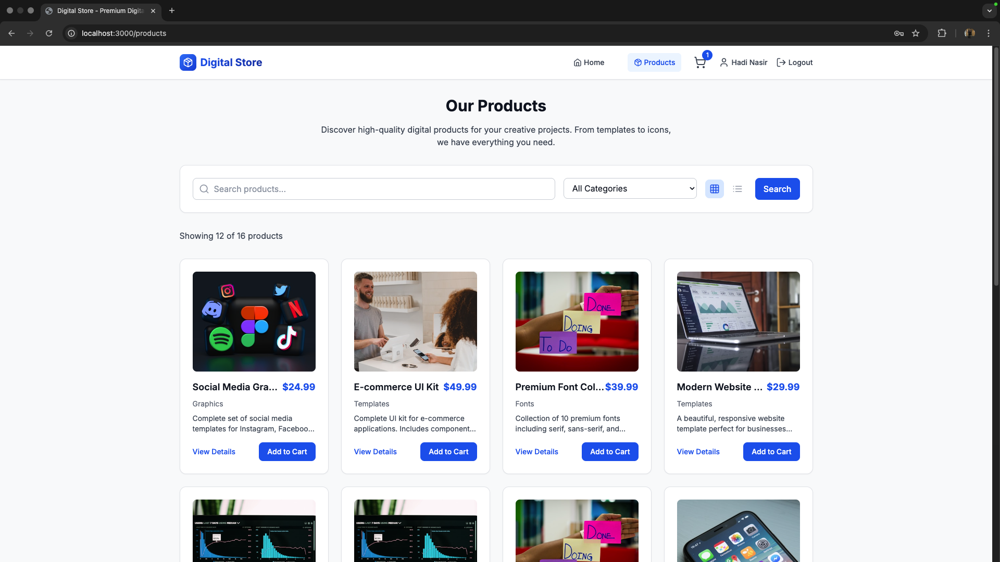

# Digital Products E-Commerce Store

A full-stack e-commerce web application for selling digital products. Built with React, Node.js, Express, SQLite, and TypeScript.

---

## 🚀 Project Overview

This project is a modern, responsive e-commerce platform for digital products (templates, icons, fonts, graphics, etc.). It features user authentication, product catalog with real images, shopping cart, order management, and more.

---

## ✨ Features

- User registration & login (JWT, bcrypt)
- Product catalog with category filtering and real Unsplash images
- Shopping cart and order management
- RESTful API (Node.js/Express/SQLite)
- Responsive UI (React, TypeScript, Tailwind CSS)
- Database seeding for demo/testing
- Protected routes for user profile and orders

---

## 🛠️ Tech Stack

- **Frontend:** React, TypeScript, Tailwind CSS
- **Backend:** Node.js, Express, TypeScript
- **Database:** SQLite
- **Authentication:** JWT, bcrypt

---

## 🖥️ Screenshots

<!-- Add screenshots to the /screenshots folder and link them here -->




---

## 📝 Demo Credentials

- **Admin:** `admin@digitalstore.com` / `admin123`
- Or register a new user account

---

## ⚡ Getting Started

### 1. Clone the repository

```bash
git clone https://github.com/yourusername/digital-store.git
cd digital-store
```

### 2. Install dependencies

```bash
npm install
```

### 3. Seed the database (optional, for demo data)

```bash
cd server
npx ts-node src/seed.ts
cd ..
```

### 4. Start the development servers

```bash
npm run dev
```

- Client: [http://localhost:3000](http://localhost:3000)
- API: [http://localhost:5001/api](http://localhost:5001/api)

---

## 📦 Folder Structure

```
FullStack/
  client/    # React frontend
  server/    # Node.js/Express backend
```

---

## 📄 License

MIT

---

## 🙌 Acknowledgements

- [Unsplash](https://unsplash.com/) for product images
- [Tailwind CSS](https://tailwindcss.com/)
- [React](https://react.dev/)
- [Express](https://expressjs.com/)

---

> **Made with ❤️ for portfolio and learning purposes.**
